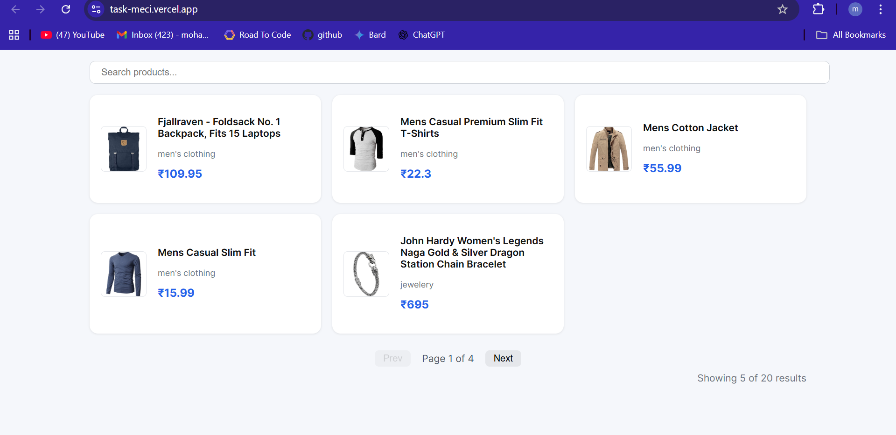

# 🛒 Product List App (React + TypeScript)

A small demo project that fetches products from a public API and displays them in a **searchable, paginated list** with loading and error states.  

This project is built as a showcase for **clean React code, API handling, and unit testing**.

---

## 🚀 Features
- 🔍 **Searchable list** — filter products by title or category.
- 📑 **Pagination** — shows 6 products per page with Prev/Next navigation.
- ⏳ **Loading state** — shows loader while fetching data.
- ⚠️ **Error state** — handles network/API errors gracefully.
- ✅ **Unit tests** — written with Vitest + Testing Library.
- 🎨 **Reusable components** — `ItemCard`, `SearchBar`, `Pagination`.
- 📦 **API integration** — [Fake Store API](https://fakestoreapi.com/products).

---

## 🛠️ Tech Stack
- [React 19](https://react.dev/) + [TypeScript](https://www.typescriptlang.org/)
- [Vite](https://vitejs.dev/) for fast bundling
- [Vitest](https://vitest.dev/) + [Testing Library](https://testing-library.com/) for testing
- ESLint + Prettier for code quality

---

## 📦 Installation & Setup

Clone the repo and install dependencies:

```bash
git clone https://github.com/junedmd/Task.git
cd client
npm install
npm run dev

```

## Running Tests

This project uses Vitest + React Testing Library.

Run all tests in watch mode

```bash 
npm test

```

## Live Link

[Click here to view the project](https://task-meci.vercel.app/)

## Screen Shots


